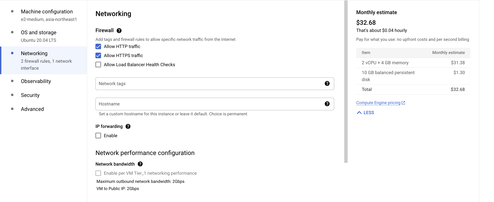

# Set Up an Ubuntu VM on Google Cloud Platform (GCP) with Jupyter Notebook and Code Server

This guide walks you through creating an Ubuntu VM on GCP, installing Code Server and Jupyter Notebook, and securely accessing these services via SSH tunneling from your local machine.  

 [](https://mermaid.live/edit#pako:eNqdkk9rAjEQxb_KEKFYcGGLILqHgrrQP2gRrT104yFmE3cxm5FsUivqd2_WqghtD3VOM3kvvzeBbAnHVJCISIVrnjFjYTCmGnx1kwFypmDIeJZrMYMgAEomk0d4dVoLBfURGltCO2yHcANtX7eUeNc99BJKHvojeBtCfTp32jqvzL6xvcqxo2TsdAlVeFAK8yEMoIYKeOBRsoN-cqlOn367_-xWG-vVF7RijriEXEOMfHmJ81Xh4uSH-cD887FVSM_g2i8AXc5FWR62-qc_PiWUdqMEdEHmSkW1tkybUjZKa3Apolqz2Tz2wTpPbRbdrT4bHBWaqBaG4SWhdyRIyTut1jWE_pkgZOcqQnwlgTRIIUzB8tT_uG1FpMRmohCURL5NhWROWUqo3nsrcxYnG81JZI0TDWLQLTISSaZKP7lVyqyIc7YwrDifrph-RzzN-y-jxOyG) 

---

## Table of Contents
1. [Create an Ubuntu VM on GCP](#create-a-vm)
2. [Connect to the VM](#connect-to-vm)
3. [Clone the Repository](#clone-repo)
4. [Install Code Server and Jupyter Notebook](#install-tools)
5. [Set Up SSH Keys (Local)](#setup-ssh-keys-local)
6. [Add SSH Key to Remote VM](#add-ssh-key-remote)
7. [Establish SSH Tunnels](#ssh-tunnel)
8. [Access Code Server](#access-codeserver)
9. [Access Jupyter Notebook](#access-jupyter)
10. [Debugging & Troubleshooting](#debugging)

---

<a name="create-a-vm"></a>
## 1. Create an Ubuntu VM on GCP

1. Log in to [Google Cloud Console](https://console.cloud.google.com).

2. Navigate to **Compute Engine** > **VM Instances**.

3. Click **Create Instance**.

4. Configure the VM:

   - **Name**: Choose a descriptive name (e.g., `dev-environment`).  

   - **Region/Zone**: Select your preferred region/zone.  

   - **Machine Type**: Choose a suitable machine type (e.g., `e2-medium` with 2 vCPUs and 4 GB memory).  

     

   - **Boot Disk**:
     - Select **Ubuntu** as the operating system.
     - Choose the latest LTS version (e.g., **Ubuntu 20.04 LTS**).
     - Set disk size (e.g., **10 GB**).

     

   - **Firewall**: Check **Allow HTTP traffic** and **Allow HTTPS traffic**.  

     

5. Click **Create** to launch the instance.

---

<a name="connect-to-vm"></a>
## 2. Connect to the VM

1. In the GCP console, go to **Compute Engine** > **VM Instances**.  
2. Next to your new instance, click the **SSH** button to open a browser-based terminal.  

---

<a name="clone-repo"></a>
## 3. Clone the Repository

In the SSH terminal (on the VM):

```bash
git clone https://github.com/jessie-sr/gcp-vm-setup.git
cd gcp-vm-setup
```

If `git` is not installed, install it with:
```bash
sudo apt update && sudo apt install -y git
```

---

<a name="install-tools"></a>
## 4. Install Code Server and Jupyter Notebook

In the same directory, make the installation script executable and run it:

```bash
chmod +x install.sh
./install.sh <CODE_SERVER_PW>
```

- **`<CODE_SERVER_PW>`**: Replace this placeholder with your desired password for Code Server authentication.
- You will be prompted to confirm installation steps if necessary.

---

<a name="setup-ssh-keys-local"></a>
## 5. Set Up SSH Keys (Local)

On your **local machine** (not the VM), open a terminal to ensure you have an SSH key:

```bash
cat ~/.ssh/id_rsa.pub
```

- If you see output like `ssh-rsa AAAAB3N...`, you already have a key.  
- If you **do not** see this output, generate a new one:

```bash
ssh-keygen -t rsa -b 4096 -C "youremail@example.com" -N "" -f ~/.ssh/id_rsa
```

---

<a name="add-ssh-key-remote"></a>
## 6. Add SSH Key to Remote VM

1. Return to the **Compute Engine** > **VM Instances** page in the GCP Console.  
2. Click **SSH** next to your instance to open another browser-based terminal.  
3. In the VM terminal:

   ```bash
   mkdir -p ~/.ssh && chmod 700 ~/.ssh
   echo "<SSH_KEY>" >> ~/.ssh/authorized_keys
   chmod 600 ~/.ssh/authorized_keys
   ```

   - **`<SSH_KEY>`**: Copy the content of your **local** `id_rsa.pub` (from step 5) and paste it here.  
   - Run:
     ```bash
     cat ~/.ssh/authorized_keys
     ```
     to verify your key was appended.

---

<a name="ssh-tunnel"></a>
## 7. Establish SSH Tunnels

On your **local machine**:

```bash
ssh -L 8080:localhost:8080 -L 8888:localhost:8888 <USERNAME>@<EXTERNAL_IP> -N
```

- **`<USERNAME>`**: Your VM username (e.g., `yourGCPUsername`).  
- **`<EXTERNAL_IP>`**: Public IP of your VM (found in the GCP console).  
- **`-L 8080:localhost:8080`**: Forwards local port 8080 to the VM’s port 8080 (Code Server).  
- **`-L 8888:localhost:8888`**: Forwards local port 8888 to the VM’s port 8888 (Jupyter).  
- **`-N`**: Instructs SSH not to execute remote commands (useful for pure port forwarding).  

> **Keep this terminal window open** as it maintains the tunnel. If you close it, you lose access to those forwarded ports.

---

<a name="access-codeserver"></a>
## 8. Access Code Server

1. On your **local machine**, open a web browser and go to:
   ```
   http://localhost:8080
   ```
2. You’ll be prompted for the password you set during installation (`<CODE_SERVER_PW>`).  
3. After logging in, you can use Code Server just like VS Code in your browser.


---

<a name="access-jupyter"></a>
## 9. Access Jupyter Notebook

1. In the VM terminal, check the Jupyter Notebook logs to retrieve the token:

   ```bash
   docker logs jupyter-notebook
   ```
   
   Look for a line like:
   ```
   http://127.0.0.1:8888/?token=...
   ```
2. Replace `127.0.0.1` with `localhost` and open it in your browser:
   ```
   http://localhost:8888/?token=<YOUR_TOKEN>
   ```
3. You should see the Jupyter Notebook interface.


---

<a name="debugging"></a>
## 10. Debugging & Troubleshooting

### 10.1 Port Conflicts
- **Symptom**: SSH tunnel command fails with `Address already in use`.  
- **Solution**:  
  1. Identify conflicting processes:
     ```bash
     sudo lsof -i :8080
     sudo lsof -i :8888
     ```
  2. Stop or kill them:
     ```bash
     kill -9 <PID>
     ```
  3. Or use alternative local ports (e.g., `8081` and `8889`):
     ```bash
     ssh -L 8081:localhost:8080 -L 8889:localhost:8888 <USERNAME>@<EXTERNAL_IP> -N
     ```

### 10.2 SSH Key Not Working
- **Symptom**: `Permission denied (publickey)`.  
- **Solution**:
  1. Confirm you added the correct key:  
     ```bash
     cat ~/.ssh/id_rsa.pub
     ```
  2. On the VM:
     ```bash
     cat ~/.ssh/authorized_keys
     ```
     Ensure the key matches exactly.
  3. Check permissions:
     ```bash
     chmod 700 ~/.ssh
     chmod 600 ~/.ssh/authorized_keys
     ```

### 10.3 Service Not Accessible
- **Symptom**: Browser times out when loading `http://localhost:8080` or `http://localhost:8888`.  
- **Solution**:
  1. Verify the tunnel is active:
     ```bash
     ps aux | grep ssh
     ```
  2. Ensure Code Server/Jupyter are running:
     ```bash
     systemctl status code-server
     docker ps
     ```
  3. Confirm firewall rules on GCP allow necessary ports or you have an active SSH tunnel.

### 10.4 Missing Tools
- **Symptom**: Commands like `git` or `docker` not found.  
- **Solution**:  
  ```bash
  sudo apt update
  sudo apt install -y git docker.io
  ```

---

## Conclusion

By following these steps, you’ll have a fully functional Ubuntu VM on GCP with **Code Server** and **Jupyter Notebook** accessible through secure SSH tunnels.  
- Use `http://localhost:8080` for Code Server.  
- Use `http://localhost:8888` for Jupyter Notebook.